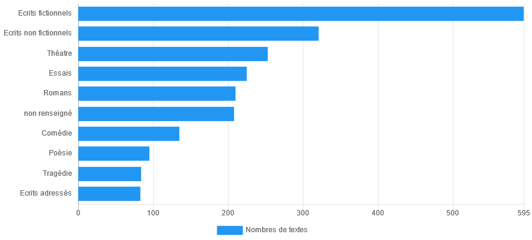
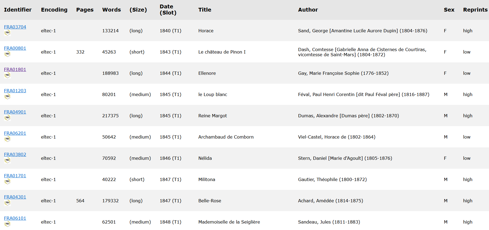
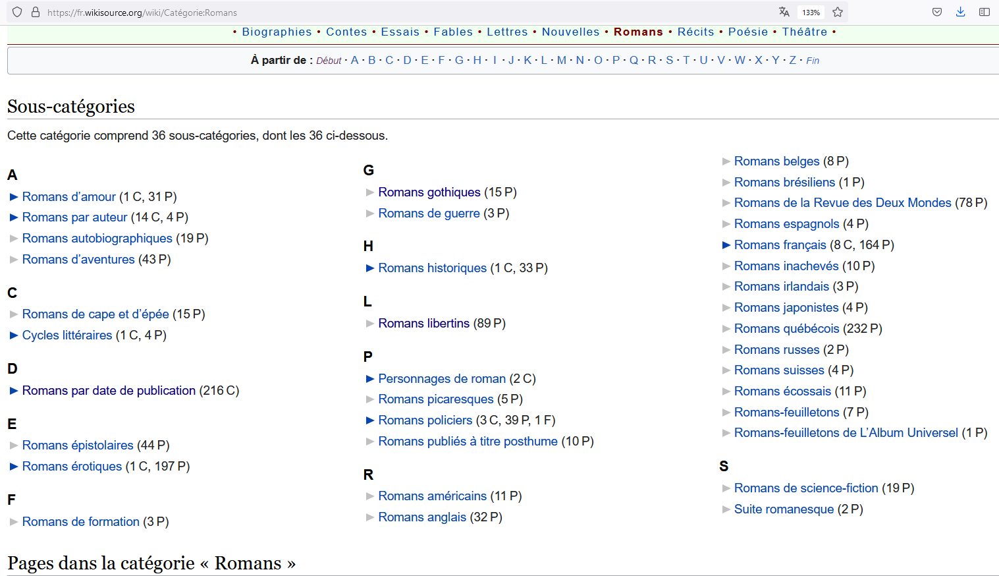
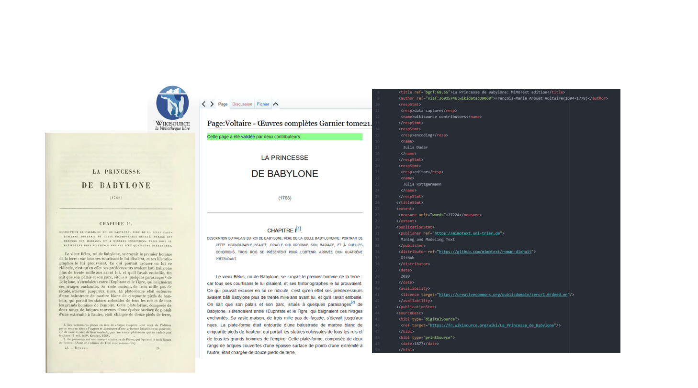
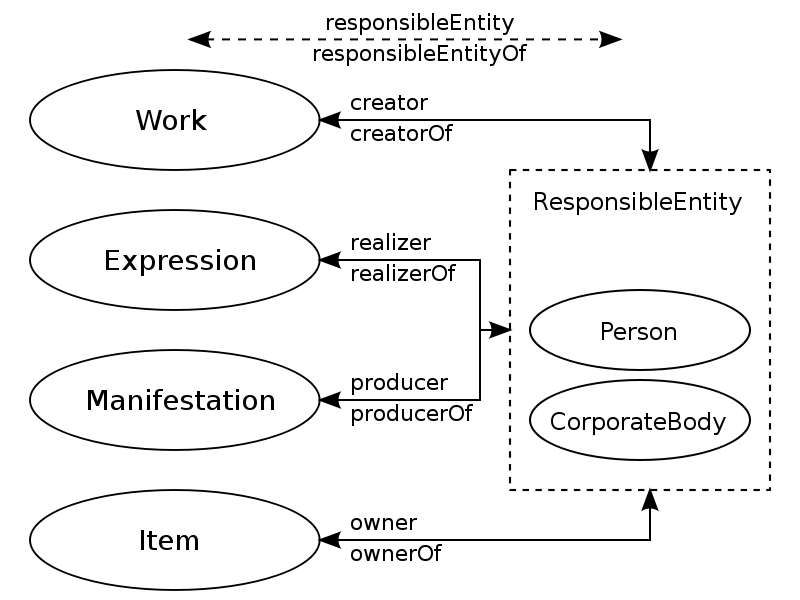
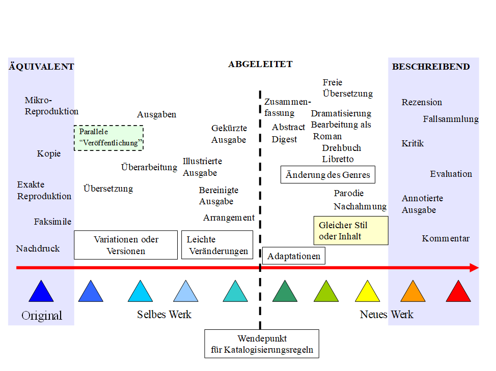
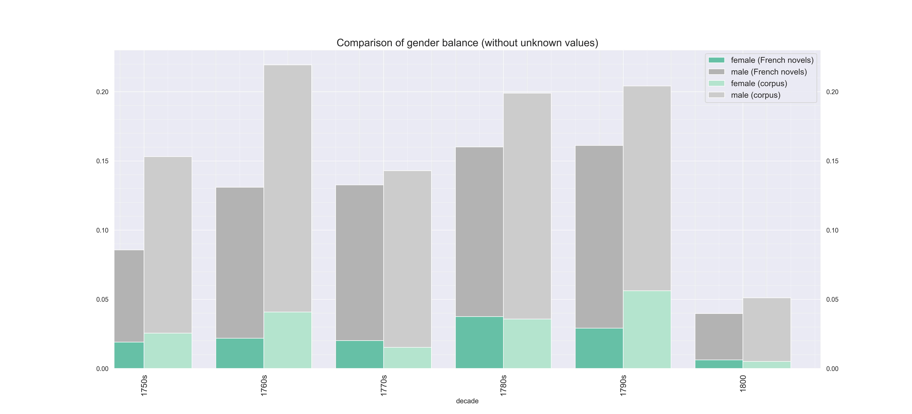
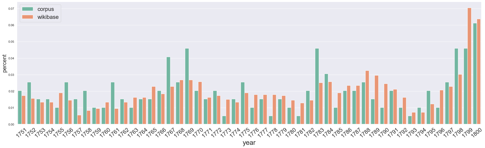
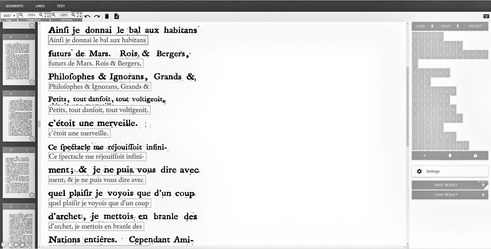
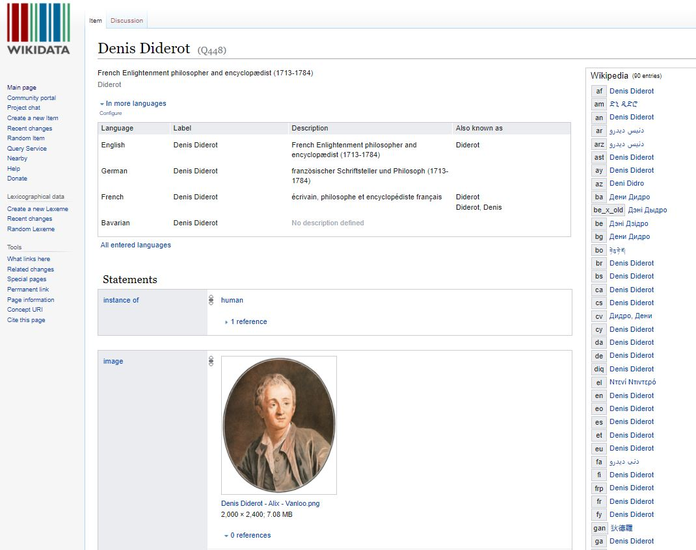

# Korpusaufbau der “Collection de romans 1751-1800”


*Data are capta*, taken not given, constructed as an interpretation of the phenomenal world, not inherent in it.

> — [@drucker_humanities_2011; pp.8]

Die zweite Hälfte des 18. Jahrhunderts ist eine Zeit voller gesellschaftlicher und kultureller Veränderungen, die sich auch in den erzählenden Texten dieser Zeit widerspiegeln. Um diese Epoche im Sinne einer “Data-Rich Literary History” [@bode_world_2018; pp.37] oder datenbasierten Literaturgeschichte zu erforschen, besteht ein erster Schritt darin, ein systematisch strukturiertes Korpus an Volltexten aufzubauen, das es ermöglicht, diese Werke in einer standardisierten und maschinenlesbaren Form zu untersuchen. Ziel des hier beschriebenen Korpusaufbaus ist es, Methoden der Computational Literary Studies (CLS) wie Topic Modeling, Named Entity Recognition oder Sentiment Analysis auf das Korpus anzuwenden, um aus den Volltexten literaturhistorisch relevante Aussagen zu extrahieren, die in einen Knowledge Graphen zur Französischen Literaturgeschichte importiert und in weiteren Abfragen analysiert werden können. Das Zielformat ist daher ein Volltext in Plaintextformat, der möglichst modernisiert und normalisiert vorliegt. Als intermediäres Format zur langfristigen Speicherung wird ein XML-Format nach den Guidelines der *Text Encoding Initiative* (TEI) anvisiert, ein Format, das sich in den Digital Humanities als Datenformat zur langfristigen Speicherung bewährt hat.

Nachdem in der Einleitung bereits das Vorhaben einer datenbasierten Literaturgeschichte und das Ziel einer Erstellung eines Wissensgraphen umrissen wurde, sollen im vorliegenden Kapitel die Strategie des Korpusaufbaus als ein repräsentatives Sampling aus der literarischen Grundgesamtheit und die weiteren Schritte der Digitalisierung und Datenbereinigung dargelegt werden.[^chapter2_corpus-1]: Teile von Kapitel 2 werden in Abwandlung auf Französisch erscheinen als Röttgermann, Julia. „Établissement d’un corpus de romans français du XVIIIe siècle dans le cadre du projet Mining and Modeling Text“. *promptus - Würzburger Beiträge zur Romanistik*, accepted. Dabei gehe ich auf die Kriterien des Korpusaufbaus, auf die Quellen des Korpus und auf die Digitalisierungspipeline mithilfe des Tools *OCR4all* [@reul_ocr4all_2019] ein. Ich beschreibe dabei das Verhältnis zwischen bibliographischen Metadaten und Volltexten und inwieweit beim Aufbau der Textsammlung FAIR data Prinzipien zum Tragen kamen. Als Zielformat liegt das Korpus in mehreren Versionen vor: als XML (Extensible Markup Language)-Datei nach den Richtlinien der *Text Encoding Initiative,* als Plaintextdokumente in den Optionen modernisiert und nicht-modernisiert. Die Eigenschaften und Vorteile dieser Formate werden erläutert und so auch mögliche Szenarien der Nachnutzung der Sammlung, die in einer offenen Lizenz zur freien Nutzung vorliegt, dargelegt.

Keywords*:* Korpusaufbau, Literaturgeschichte, OCR4all, Optical Character Recognition, Double-Keying, Metadaten, Balancing, Text Encoding Initiative, XML, FAIR data, FRBR, Wikidata.

## Kriterien des Korpusaufbaus

Was ist ein Korpus? Im *Dictionnaire raisonné des sciences, des arts et des métiers* von D’Alembert und Diderot wird als “corps” “en matiere \[sic\] de Littérat.” Folgendes definiert: “plusieurs ouvrages de la même nature rassemblés & reliés ensemble” [@dalembert_encyclope_1751; pp.266]. In der modernen Korpuslinguistik versteht man unter Korpus eine “Sammlung von Textdaten, also Sprache im Kontext, die dem Zweck der linguistischen Auswertung dient und eine quantitative Auswertung von (qualitativen) sprachlichen Merkmalen zulässt. [@hirschmann_theoretische_2019; pp.2]. Im Kontext der Digital Humanities werden oft umfangreiche und vielfältige digitale Korpora erstellt, um sprachliche Muster, kulturelle Entwicklungen oder historische Veränderungen mithilfe von digitalen Methoden zu untersuchen. Eine Datensammlung in den Digital Humanities kann man definieren als “Zusammenführung einzelner (bereits existierender oder eigens erstellter) Datensätze nach einer Einheit stiftenden Systematik” [@schoch_aufbau_2017; pp. 223]. Kriterien können dabei zeitlicher und/oder räumlicher Natur sein und bei Textsammlungen die Gattung, Sprache oder Urheber:innen betreffen.\
Als bestehende Beispiele relevanter digitaler Datensammlungen französischer erzählender Texte seien hier *Frantext*, *ELTeC* und *Wikisource* genannt. *Frantext* ist eine seit 1998 bestehende Datenbank, die aktuell 268 Mio Wörter enthält.[^chapter2_corpus-2] Zunächst lag der Fokus der Datensammlung auf der Sprache des 19. und 20. Jahrhunderts und wurde erst später um Texte aus dem Mittelalter oder dem 18. Jahrhundert erweitert, bei gleichzeitiger Erweiterung um weitere moderne Texte. Die Datensammlung enthält 10% wissenschaftliche und technische Texte und 90% literarische Texte, die verschiedene Gattungen umfassen: Romane, Memoiren, Autobiographien, Tagebücher, Theaterstücke, Gedichte, Essays. Das “Corpus classique” umfasst die Zeit 1650-1799. Filtert man nach Gattung ‘roman’ und Erstpublikation 1751-1799 bleiben 28 Texte übrig, von denen einige Textfiles Aufteilungen in Bände (tome I, tome II), also Teile von Werken darstellen. Frantext lässt sich über den Shibboleth-Zugang der Universität Trier mit Login abrufen, stellt jedoch keine schrankenlos frei verfügbare Textsammlung dar.

[^chapter2_corpus-2]: Zahl laut Selbstauskunft auf [www.frantext.fr](http://www.frantext.fr), <https://www.frantext.fr/repository/frantext>.


**Abb. 2.1** “Corpus classique”, 1650-1799, Frantext.[^chapter2_corpus-3]

[^chapter2_corpus-3]: <https://www.frantext.fr/repository/frantext/corpora>.

Die *European Literary Text Collection (ELTeC)* hingegen ist eine im Kontext der COST Action ‘Distant Reading for European Literary History’ 2017-2022 erstellte multilinguale Sammlung an erzählenden Texten 1840 bis 1919, aufgebaut mit dem Ziel eine Referenzsammlung für die Digital Humanities hinsichtlich literaturhistorischer Forschung aufzubauen. Um eine Vergleichbarkeit der verschiedensprachlichen Sammlungen untereinander herzustellen, wurden die Sammlungen nach bestimmten Parametern zusammengestellt, die unter anderem die Textlänge, die Kanonizität, Gender und die Anzahl an Werken pro Autor:in betreffen. Die anvisierten Werte sind für alle Sprachen einheitlich definierte Werte und orientieren sich nicht an der jeweils historischen Anzahl an Romanveröffentlichungen. Die Kernsammlung von 10 Korpora mit jeweils 100 Texten in 10 verschiedenen europäischen Sprachen wurde 2021 vollendet und liegt frei verfügbar auf GitHub vor. ELTeC-core wurde mittlerweile um verschiedene Erweiterungen (ELTeC extensions) ergänzt, sodass auch Sammlungen 1750 bis 1840 integriert werden können.

Ein Subkorpus von 100 ausgewählten Werken aus dem hier beschriebenen Romankorpus roman18 hat daher als ELTeC extension innerhalb der *European Literary Text Collection* einen weiteren Publikationsort gefunden.[^chapter2_corpus-4]\


**Abb. 2.2** Ausschnitt aus der Sammlung European Literary Text Collection, ELTeC-fra.[^chapter2_corpus-5]

[^chapter2_corpus-4]: Es wurden bereits 100 Werke als Subkorpus zusammengestellt, die bereits im Repositorium von ELTeC gespeichert sind: <https://distantreading.github.io/ELTeC/fra-ext2/index.html>.

[^chapter2_corpus-5]: <https://distantreading.github.io/ELTeC/fra/index.html>

Im Unterschied dazu ist *Wikisource* eine sehr breite Datensammlung von transkribierten Primärtexten aller Art, die alle urheberrechtsfrei sind oder unter einer freien Lizenz stehen. Das Projekt der Wikimedia Foundation gruppiert die Texte in verschiedenen Kategorien ein, so dass nach Romanen und Erstpublikationsdatum gefiltert werden kann (s. Abb 2.3).\


**Abb. 2.3** Subkategorien der Kategorie “Romans” auf Wikisource, Wikimedia Foundation 2023.[^chapter2_corpus-6]

[^chapter2_corpus-6]: <https://fr.wikisource.org/wiki/Cat%C3%A9gorie:Romans>.

Filtert man nach Kategorie “Romans” und Erstpublikationsdatum 1751-1800, bleiben 38 Texte übrig, die jedoch auch nicht vollständig transkribierte Texte und auch Texte von Autor:innen außerhalb Europas enthalten. Des Weiteren besteht eine große Überschneidung zwischen Werktiteln aus Frantext und Wikisource.\
Die beschriebenen Datensammlungen auf Wikisource und Frantext enthalten wie gezeigt zwar relevante erzählende Texte der Zeit 1751-1800, jedoch ist die dort enthaltene Größenordnung an verfügbaren Texten (\<40) nicht ausreichend, um Aussagen im Sinne einer datenbasierten Literaturgeschichte machen zu können. Die Sammlung ELTeC verfolgt einen geeigneten Ansatz, deckt jedoch einen anderen zeitlichen Rahmen (1840 - 1920) ab.\
Der Aufbau einer frei verfügbaren Datensammlung an französischer fiktionaler Prosa 1751-1800 stellt meiner Recherche nach eine Forschungslücke dar und war somit der erste Schritt, auf dem die im Weiteren beschriebenen Analysen aufbauen. Als Größenordnung der Datensammlung wurde ein Anteil an 10% der bekannten Romanveröffentlichungen anvisiert, was circa 200 Werken entspricht.\

**Abb. 2.4** Ein Roman in drei verschiedenen Repräsentationen: als Faksimile, als Wikisource-Objekt und als TEI/XML-File.

Wie können wir von Daten in den Geisteswissenschaften sprechen? Christof Schöch definiert Daten in den Geisteswissenschaften folgendermaßen: ”Data in the humanities could be considered a digital, selectively constructed, machine-actionable abstraction representing some aspects of a given object of humanistic inquiry.“ [(Schöch 2013, 4)]). Wie Johanna Drucker, die von “data are capta” [(Drucker 2011, 8)] spricht, wird damit auch der Aspekt betont, dass die Kategorien der gewählten Abstraktion – in diesem Fall unter anderem ein Roman als TEI/XML-File mit bestimmten ausgezeichneten Elementen – eine Auswahl aus der Vielfalt der Eigenschaften des Objekts darstellen. Auch in einer vermeintlich objektiven Apparatur sind Theorien verdinglicht, wie Gaston Bachelard 1934 ausführt [(Bachelard 1968, 15)](https://www.zotero.org/google-docs/?GR05Ur).[^chapter2_corpus-7] Bachelard beobachtet das für die wissenschaftlichen Messgeräte seiner Zeit wie Thermometer oder Mikroskope, der Gedanke lässt sich jedoch auch auf die wissenschaftliche Apparatur des Computers übertragen.[^chapter2_corpus-8]\
In Bezug auf sein Axiom "The medium is the message" argumentiert hingegen McLuhan, dass Technologien nicht einfach Erfindungen sind, die der Mensch einsetzt, sondern eine völlig neue Umgebung für den Menschen darstellen.[^chapter2_corpus-9] Als Beispiel führt er das elektronische Zeitalter an: “in the electronic age, data classification yield to pattern recognition” [(McLuhan und Gordon 2003, 12)](https://www.zotero.org/google-docs/?47Xbnj). So könnte man in Anlehnung an diesen Gedanken von McLuhan formulieren, dass die Möglichkeiten der in den Computational Literary Studies verwendeten Algorithmen einen neuen Rahmen oder eine neue Umgebung darstellen, innerhalb der die Literaturgeschichtsschreibung neu ergänzt und geschrieben werden kann.\
Die Kategorien in der verwendeten Auszeichnungssprache (XML), die selektiert wurden, um digitale Texte in Markup zu kodieren, wie beispielsweise die Elemente und Attribute in einem XML-Dokument sind dabei nur eine Auswahl an möglichen Auszeichnungen, die man vornehmen könnte (Abb. 2.4).

[^chapter2_corpus-7]: “Naturellement, dès qu'on passe de l'observation à l'expérimentation, le caractère polémique de la connaissance devient plus net encore. Alors il faut que le phénomène soit trié, filtré, épuré, coulé dans le moule des instruments, produit sur le plan des instruments. Or les instruments ne sont que des théories matérialisées. Il en sort des phénomènes qui portent de toutes parts la marque théorique.” [(Bachelard 1968, 15)](https://www.zotero.org/google-docs/?uAE0ie)

[^chapter2_corpus-8]: cf. auch dazu Hans Blumenbergs Ausführungen in *Lebenswelt und Technisierung*, der in Anlehnung an Husserl unterstreicht: “Die Technik ist primär nicht ein Reich bestimmter, aus menschlicher Aktivität hervorgegangener Gegenstände; sie ist in ihrer Ursprünglichkeit ein Zustand des menschlichen Weltverhältnisses selbst.” (Blumenberg 1963: 19) .

[^chapter2_corpus-9]: “The medium is the message” means, in terms of the electronic age, that a totally new environment has been created [(McLuhan und Gordon 2003, 13)](https://www.zotero.org/google-docs/?m2RJFc).

Wie Berenike Herrmann und Gerhard Lauer im Hinblick auf den Aufbau von Datensammlungen bemerken, finden sich zwar online umfangreiche Textsammlungen teils mit beeindruckender Anzahl an Werken, wie Google Books oder HathiTrust, jedoch sind sie selten nach fachwissenschaftlichen Kriterien als Sample aus einer Grundgesamtheit, sondern häufig aus pragmatischen Gründen der Verfügbarkeit zusammengestellt. [^chapter2_corpus-10]

[^chapter2_corpus-10]: “Im fachwissenschaftlichen Sinne repräsentative, weil kriteriengeleitet und mit Bezug auf eine angenommene Grundgesamtheit gesampelte Korpora gibt es \[...\] derzeit in der Literaturwissenschaft nur ansatzweise.” [(Herrmann und Lauer 2018, 130)](https://www.zotero.org/google-docs/?vaLrt7).

Im Hinblick auf den Aufbau der Textsammlung macht es Sinn, sich das Verhältnis zwischen Archiv, Kanon und Korpus zu verdeutlichen. Jenes Verhältnis kann anhand des Literary Pamphlet 11 des *Stanford Literary Lab* verstanden werden (Algee-Hewitt et al. 2016: 2). Algee-Hewitt et al. unterscheiden zwischen "“the published, the archive, and the corpus”. In der Betrachtung von Algee-Hewitt et al. ist jedes Verhältnis eine Teilmenge des vorherigen Verhältnisses. Das Archiv ist demnach eine Teilmenge aller je veröffentlichten Texte, der Kanon eine Teilmenge aus dem Archiv und das Korpus ebenfalls eine (andere) Auswahl aus dem Archiv.[^chapter2_corpus-11]\

![Verhältnis “the published /“the archive” / “the corpus”/ “the canon” [cf. Heuser / Algee-Hewitt / Lockhart (2016); Stanford Literary Lab:2]. Die die Romanveröffentlichungen dokumentierenden Metadaten dienen als Parameter zur Ausbalancierung der Volltextsammlung roman18.](img_02/korpusaufbau_ausbalancierung_Version2.png)

**Abb. 2.5** Verhältnis “the published /“the archive” / “the corpus”/ “the canon” [cf. @heuser_mapping_2016; Stanford Literary Lab:2]. Die die Romanveröffentlichungen dokumentierenden Metadaten dienen als Parameter zur Ausbalancierung der Volltextsammlung roman18.

[^chapter2_corpus-11]: Eine kritische Betrachtung, inwieweit die Auswahl eines Archivs auch von Imperialismus und Nationalismus getrieben sein kann, lieferte Amalia S. Levi in der Opening Keynote der DHd-Konferenz 2022 [@levi_filling_2022]

Für die Domäne des französischen Romans der zweiten Hälfte des 18. Jahrhunderts bestehen die erfreulichen Umstände, dass hinsichtlich der Grundgesamtheit der literarischen Produktion eine Dokumentation aller überliefert veröffentlichten Romane vorliegt, die Angus Martin, Vivienne Mylne und Richard Frautschi bis 1977 in einem über zehn Jahre dauernden, kollaborativen Forschungsprozess zusammengetragen haben. Das ist insofern eine Besonderheit, als dass die vollständige Dokumentation der literarischen Produktion einer Domäne eher den Ausnahmefall darstellt. Ted Underwood umreißt in “Do we Understand the Outlines of Literary History?” die lückenhaften Korpora, mit denen man in den Digital Humanities üblicherweise vorlieb nehmen muss, beispielsweise bei der Arbeit mit HathiTrust.[^chapter2_corpus-12] Große Lücken in den Metadaten oder den berücksichtigten Volltexten einer Epoche lassen dann nur bedingt übergreifende Aussagen zur Literaturgeschichte zu. Er illustriert dies am Beispiel der Entwicklung der Erzählformen [@underwood_we_2013; pp. 1–33].\
Die vorliegende Romansammlung roman18 kommt den von Lauer und Herrmann [@herrmann_korpusliteraturwissenschaft_2018; pp. 130] formulierten wünschenswerten Kriterien eines Samplings des Korpus nach fachwissenschaftlichen Kriterien der Domäne (Literaturwissenschaft) hingegen approximativ nach: Es wurde ein Korpus an Primärtexten zusammengestellt, das französische erzählende Texte der zweiten Hälfte des 18. Jahrhunderts im Sinne eines repräsentativen Samples aus der literarischen Grundgesamtheit an Romanen dieser Dekaden enthält. Es handelt sich dabei nicht um ein zufälliges Sampling (Random Sampling), sondern die Werke wurden systematisch anhand ihrer Metadaten in Kombination mit der Verfügbarkeit einer Print- oder Digitalquelle des Volltextes zusammengestellt.\
Das Sampling bezieht sich dabei auf die Parameter **Erstpublikationsdatum**, **Gender** und **Erzählform** und bezieht sich auf Metadaten, die zur Gesamtproduktion aller französischen Romane 1751-1800 in besagter Bibliographie vorliegen [@martin_bibliographie_1977]. Die Verteilung der Parameter in der gesamten Romanproduktion sollten so “en miniature” im Volltextkorpus nachgebildet werden. Das Balancing hinsichtlich dieser Kategorien hat als Ziel, beim Korpusdesign repräsentativ vorzugehen, wie es auch von Douglas Biber beschrieben wird: “Representativeness refers to the extent to which a sample includes the full range of variability in a population.” [@biber_representativeness_1993; pp. 243].

[^chapter2_corpus-12]: Die *HathiTrust Shared Digital Repository* startete zunächst als Backup von Google Books und wurde am 13. Oktober 2008 von einer Gruppe der größten amerikanischen Forschungsbibliotheken gegründet. In diesem gemeinsamen Projekt werden umfangreiche digitale Sammlungen von Büchern, sowohl Metadaten als auch Volltexte, archiviert und erhalten.

Das Volltext-Korpus grenzt sich hinsichtlich der Sprache, der Gattung und des Zeitraums demnach folgendermaßen ab:

(1) Sprachliche Abgrenzung: Es werden Werke betrachtet, die auf Französisch verfasst wurden. Der Schwerpunkt liegt geographisch auf dem französischen Mutterland, aber beinhaltet auch einige Werke der Frankoromania.\

(2) Gattungsgrenzen: Hinsichtlich der Gattung liegt der Fokus des Textkorpus auf erzählenden Werken. Dabei folge ich der relativ breiten und inklusiven Definition, die die Bibliograph:innen der *Bibliographie du genre romanesque français, 1751-1800* ihrer Bibliographie zugrunde legen (Mylne, Martin und Frautschi 1977: ix-xxxv). In der Einleitung der *Bibliographie du genre romanesque français, 1751-1800* definieren die Autor:innen die erfassten Werke folgendermaßen: “tout ce qui a été publié en langue française en matière de roman, de conte, de nouvelle, de récit fictif en prose sous toutes les formes” (Mylne, Martin und Frautschi 1977: ix). Auch für das Romankorpus werden fiktionale Werke verschiedener Länge, Briefromane, Dialogromane, aber auch Novellen und Erzählungen inkludiert.

(3) Zeitliche Grenzen: Hinsichtlich des betrachteten Zeitraums werden Werke aufgenommen, die einschließlich 1751-1800 erstmals erschienen sind.

## Unschärfen / Grenzfälle

Die zunächst eindeutig erscheinenden Kategorien (Erstpublikationsdatum, Gattung, Sprache) erwiesen sich in der Praxis nicht immer als stabile Grenzen. Die hier betrachteten Dekaden sind gezeichnet von politischen und gesellschaftlichen Umbrüchen, die auch für die erscheinenden Werke Auswirkungen haben. Das Datum des Redigierens und des Publizierens liegt teilweise weit auseinander.[^chapter2_corpus-13] Einige wichtige Werke dieser Zeit wie *Les Cent Vingt Journées de Sodome* von De Sade wurden im genannten Zeitraum erstellt, aber erst viel später publiziert. Einige solcher Ausnahmen wurden in das Korpus aufgenommen, aber durch Kommentare im XML-Element \<sourceDesc\> im teiHeader näher beschrieben und erläutert:

[^chapter2_corpus-13]: Nicht mit in Betracht gezogen ist dabei, dass die Publikation als Druck sich im 18. Jahrhundert in Frankreich außerdem von der Zirkulation in Manuskriptform und von partieller Publikation in Zeitschriften unterscheidet. Da die verwendeten bibliographischen Metadaten nur von der geschlossenen Werkform ausgehen, bleiben diese Phänomene für die vorliegende Analyse leider unberücksichtigt.

\<bibl type="unspecified"\>\
\<!-- Text included in the MiMoText corpus due to creation in 1785 (stated in:LES CENT-VINGT JOURNÉES DE SODOME OU L'ÉCOLE DU LIBERTINAGE, in: Jens, Walter, und Rudolf Radler, Hrsg. Kindlers neues Literatur-Lexikon.Bd. 22: Supplement L - Z. Studienausg. Frechen: KOMET, 2001.) The following \<date\> therefore represents the year of creation.--\>

\<date\>\
1785\
\</date\>\
\</bibl\>

Ein anderes Beispiel ist Arnauds *Les époux malheureux* (1783); eine neue Version eines bereits 1746 publizierten Werkes, welches jedoch zwei neue Teile enthält, wurde in das Romankorpus aufgenommen.\
Voltaires *Babouc* (1751), das unter dem Titel *Le monde comme il va* bereits 1748 erschienen ist, wurde nachträglich aussortiert, bzw. in eine “extended version” des Korpus verschoben, da die Textgrundlage nicht wesentlich von der früheren Version abweicht [@martin_bibliographie_1977; pp. 58]. Diderots *L'Oiseau blanc* wurde 1748 geschrieben, aber 1798 erstmals publiziert und demnach aufgenommen.\
Diese und weitere Grenzfälle wurden innerhalb der erstellten XML/TEI-Dateien im TEI-Header erläutert, um in der Entscheidungsfindung transparent zu sein.

## Werkabgrenzungen: Wann ist ein Werk ein neues Werk?

Die Grenzfälle verweisen auf eine grundsätzliche Frage der Trennschärfe zwischen Manifestation, Werk und Edition und auf Frage der Abgrenzung zweier Entitäten auf Work-(Werk)-Ebene. Im Sinne der Prinzipien der “Functional Requirements for Bibliographic Records” (FRBR) kann man zwischen Werk, Expression, Manifestation und Item unterscheiden. Diese sind dabei folgendermaßen definiert:


**Abb. 2.6** Functional Requirements for Bibliographic Records

1.  Werk (Work): Ein Werk wird als abstrakte Konzeption eines kreativen oder intellektuellen Inhalts definiert. Es repräsentiert die Idee oder den Inhalt eines Werkes unabhängig von spezifischen Ausgaben, Übersetzungen oder körperlichen Manifestationen. Ein Werk kann beispielsweise ein bestimmtes Buch, Gemälde, Musikstück oder Film sein.\
2.  Expression: Eine Expression ist die spezifische Art und Weise, wie ein Werk verkörpert oder dargestellt wird. Sie bezieht sich auf die sprachliche, künstlerische oder intellektuelle Form, in der ein Werk ausgedrückt wird. Eine Expression kann verschiedene Formen annehmen, wie zum Beispiel eine bestimmte Sprache, eine musikalische Partitur oder eine Übersetzung.\
3.  Manifestation: Eine Manifestation ist eine physische oder digitale Realisierung einer Expression. Sie bezieht sich auf eine konkrete Version eines Werkes, die als Einheit betrachtet werden kann. Beispiele für Manifestationen sind gedruckte Bücher, digitale E-Books, Gemälde oder Tonträger.\
4.  Exemplar (Item): Ein Exemplar ist eine einzelne physische oder digitale Instanz einer Manifestation.

Eine interessante Frage ist dabei auch, ab wann ein Werk ein neues Werk ist. Werke als Knoten im Graphen sind im Gegensatz zu natürlichen Personen nicht eindeutig abgrenzbar. Man kann zur Beantwortung dieser Frage auf ein skalares Modell zurückgreifen (s. Abb. 2.7).

**Abb. 2.7** Werkfamilie oder die Abgrenzungsproblematik (nach [Tillet 2005, 4)](https://www.zotero.org/google-docs/?Zl1CkI).

In Abb. 2.7 lässt sich erkennen, in welchen Abstufungen ein Ausgangswerk als selbes Werk oder als neues Werk gewertet werden kann. Eine neue Ausgabe, eine Illustrierung, eine Übersetzung werden in dieser skalaren Anordnung als ‘selbes Werk’ gewertet, während Parodien, freie Übersetzungen, Dramatisierungen oder auch eine Änderung des Genres als ‘neues Werk’ gewertet werden.\
Die verwendeten bibliographischen Metadaten [(Martin, Mylne, und Frautschi 1977)](https://www.zotero.org/google-docs/?aBw3qF) enthalten ebenfalls in der Frage der Werkabgrenzung implizite Entscheidungen. Im Sinne einer einheitlichen Vorgehensweise ist ein Werk ein neues Werk im Knowledge Graphen, wenn es aus der die Datenbasis stiftenden Quelle der *Bibliographie du genre romanesque francais, 1751-1800* als neuer Eintrag mit Identifier hervorgeht.

Für den Korpusaufbau weiterhin relevant ist, dass ein selbes Werk in verschiedenen Expressionen unterschiedliche Titel tragen kann. Dieses Phänomen wird sowohl in den bibliographischen Metadaten abgebildet (nämlich in der Aufzählung der verschiedenen Editionen pro Eintrag) und kann im Wissensgraphen in der Software Wikibase ebenfalls modelliert werden. Zu jedem Label eines Items beispielsweise “Lettres de deux amans, habitans d’une petite ville au pied des Alpes “ (Q1429), gibt es ebenfalls die Property “Also known as”, die dann ein alternatives Label enthalten kann, beispielsweise “La nouvelle Héloi͏̈se”.[^chapter2_corpus-14]\
Wann immer im Korpusaufbau der Romansammlung von den Knoten des Knowledge Graphen vereinzelt abgewichen wurde, ist dies im TEI-Header der XML-Version der Dateien vermerkt.

[^chapter2_corpus-14]: Ein Beispiel für einen alternativen Labeleintrag findet man im Graphen bei Item Q1429 mit *Lettres de deux amans, habitans d’une petite ville au pied des Alpes* & *La nouvelle Héloi͏̈se* <https://data.mimotext.uni-trier.de/wiki/Item:Q1429>

### Textquellen
Für den Aufbau der Textsammlung werden einerseits verfügbare Scans (insbesondere aus Gallica der *Bibliothèque Nationale Française*) und geprüfte Texte insbesondere von *Wikisource.fr*, *Ebook libres et gratuits* und *Frantext* gesammelt, andererseits das Verfahren des sogenannten ‘Double Keying’ auf ein Korpus bisher nicht im Volltext verfügbarer Texte angewendet. Alle Texte werden mit Hilfe von Skripten (in TUSTEP und/oder Python) in ein einheitliches XML-Format konvertiert, das den Richtlinien der *Text Encoding Initiative* [(Burnard 2014)](https://www.zotero.org/google-docs/?TGjn6e) entspricht. Für die ‘Double Keying’-Dateien wurde zudem eine der Vorlage besonders nahe Textfassung erstellt, auf deren Grundlage mit dem Tool OCR4all [(cf. Reul u. a. 2019)](https://www.zotero.org/google-docs/?1IvomD) ein OCR-Modell für französische Drucke der zweiten Hälfte des 18. Jahrhunderts trainiert wurde, mit dem weitere bildbasierte Scans in Volltext überführt werden konnten.[^chapter2_corpus-15]

[^chapter2_corpus-15]: Das OCR-Modell liegt frei verfügbar auf GitHub: “Calamari models: 18th_century_french” , [https://github.com/Calamari-OCR/calamari_model](https://github.com/Calamari-OCR/calamari_models)s.

Im Folgenden eine Erläuterung zu den genannten Quellen des Volltextkorpus:

-   *Wikisource* (ein Schwesterprojekt von Wikipedia) vereint Primärtexte in über 70 Sprachen. In einer auf Crowdsourcing basierenden Transkriptionsumgebung werden Faksimile und per Optical Character Recognition erkannter Text nebeneinander gestellt und von der Crowd korrigiert. Die Dateien durchlaufen verschiedene Qualitätsstufen. Es wurden Texte aufgenommen, die mindestens durch ein gelbes oder grünes Label ausgezeichnet sind, also vollständig transkribiert und von mindestens zwei verschiedenen Personen korrigiert wurden.\
-   Auf der Website *Ebooks libres et gratuits* konnten vor allem Werke kanonischer Autor:innen gefunden werden. Sie wurden als EPUB heruntergeladen und in TEI/XML konvertiert. Ein Nachteil der Plattform ist, dass sich die Provenienz der analogen Datenquelle (Print) leider nicht einsehen lässt.\
-   Die Datenqualität der französischen Romane, die sich im entsprechenden Publikationsdatum frei verfügbar als EPUB auf *GoogleBooks* finden ließ, war sehr divers. Es wurden Werke nach der verfügbaren Qualität im Hinblick auf eine möglichst geringe OCR-Fehlerquote ausgewählt.\
-   *Frantext* enthält Primärtexte verschiedener Gattungen vom IX. bis XXI. Jahrhundert. Es wurden Texte verwendet, die den Kriterien Publikationsdatum 1751-1800, Gattung “roman” und Lizenz “licence libre” entsprechen. Das auf Frantext vorliegende TEI/XML enthält eine Vielzahl an linguistischen Annotationen, die mit Hilfe eines Skripts entfernt wurden.[^chapter2_corpus-16]\
-   *rousseauonline.ch* bietet Zugang zu allen Werken von Jean-Jacques Rousseau (1712-1778) in ihrer ersten Referenzausgabe. Die Texte sind online zum Lesen zugänglich und stehen zum kostenlosen Download als PDF oder EPUB zur Verfügung.[^chapter2_corpus-17]

[^chapter2_corpus-16]: h[ttps://github.com/MiMoText/roman18/blob/master/Python-Scripts/Umwandlung_Frantext-Werke_in_TEI.py](https://github.com/MiMoText/roman18/blob/master/Python-Scripts/Umwandlung_Frantext-Werke_in_TEI.py), 6.12.2022.

[^chapter2_corpus-17]: <https://www.rousseauonline.ch/>, 6.12.2022.

In diesem Zusammenhang stellt XML (Extensible Markup Language) in Verbindung mit den Richtlinien der TEI (Text Encoding Initiative) ein geeignetes Format dar, um literarische Texte zu kodieren und zu organisieren. Die TEI-Richtlinien bieten einen umfassenden Standard für die textuelle Kodierung und Beschreibung von literarischen Werken und ermöglichen es Forschenden, detaillierte Metadaten zu erfassen. Alle Input-Dateien wurden in TEI-konformes XML nach den Richtlinien der *Text Encoding Initiative* [(Burnard 2014)](https://www.zotero.org/google-docs/?8V58SA) nach dem Schema der *European Literary Text Collection* (*ELTeC*) in Level1 kodiert [(Lou Burnard und Carolin Odebrecht 2019)](https://www.zotero.org/google-docs/?I442ZU).

Mit Hilfe eines Python-Skripts, das historische Verbformen und Schaft-S in den historischen Texten umwandelt, wurden die Texte auf der Grundlage der XML-TEI-Dateien zudem teilmodernisiert, normalisiert und als Plaintext extrahiert.[^chapter2_corpus-18] Wie bereits erwähnt liegt als Vergleichshorizont der Daten eine nahezu vollständige Dokumentation der literarischen Produktion französischer fiktionaler Werke 1751-1800 in Form einer Bibliographie [(Martin, Mylne, und Frautschi 1977)](https://www.zotero.org/google-docs/?viBHsh) vor, die dank wissenschaftlicher Vorarbeiten digitalisiert in Form eines RDF-Graphen verwendet werden konnte [(Lüschow 2019)](https://www.zotero.org/google-docs/?g9K1dG).

[^chapter2_corpus-18]: <https://github.com/MiMoText/roman18/tree/master/Python-Scripts/modernization%20and%20transformation%20to%20plaintext>, 6.12.2022.

Aufgrund der statistischen Merkmale dieser bibliographischen Daten habe ich mich hinsichtlich der Ausgewogenheit des Romankorpus den Proportionen in diesen Metadaten angenähert und Merkmale wie Genderverteilung oder Erstpublikationsdaten approximativ im Romankorpus abgebildet (@gender-fig). Die Angabe zum Geschlecht der Autor:innen ist nicht explizit in den Metadaten enthalten, wurde jedoch mithilfe der Python-Bibliothek gender-guesser ermittelt [@elmas_gender-guesser_2016]. Dazu wurden die Vornamen der Autor:innen mit dem gender-guesser in die Kategorien weiblich, männlich oder unbekannt eingeteilt. Zusätzliche domänenspezifische Begriffe wie "Madame”, “Comtesse”, “Baronne“oder “Abbé”, “Baron”, “Chevalier” wurden der Liste noch hinzugefügt.
{#gender-fig}

[^chapter2_corpus-19]: <https://github.com/MiMoText/balance_novels>.

**Abb. 2.8** Annäherung der Gender-Verteilung zur bekannten Romanproduktion aus den bibliographischen Metadaten (grün: weiblich/grau: männlich) beim Erstellen des Romankorpus (hellgrün: weiblich / hellgrau: männlich), Ansicht pro Dekade ohne ‘unknown’ Werte.

Bei Abkürzungen wie “M\*\*\* C\*\*\* de L\*\*\*”, die nicht eindeutig erkennbar männliche oder weibliche Vornamen oder sonstige Titel (Marquise, Abbé, Baron etc.) enthalten, ist die Kategorie “unbekannt“.

Das Romankorpus wurde im Projekt fortlaufend um weitere erschlossene Quellen erweitert und ist somit kontinuierlich gewachsen, der Korpusaufbau ist Ende 2023 zum Abschluss gekommen. Das finale Korpus ist auf GitHub und Zenodo veröffentlicht und zusätzlich im Forschungsdatenrepositorium Romanistik auf Zenodo integriert [(Röttgermann 2021; 2023)](https://www.zotero.org/google-docs/?dL0rkv)[^chapter2_corpus-20]. Das Korpus wurde auf Zenodo 2101 Mal betrachtet und 48 Mal heruntergeladen (Stand 7.5.2024), was davon zeugt, dass die Daten auch für externe Forschende von Interesse zu sein scheinen.

[^chapter2_corpus-20]: <https://zenodo.org/communities/reporom?q=&l=list&p=1&s=10&sort=newest>,

## Die reichhaltigen Metadaten der « Bibliographie du genre romanesque » als statistische Grundlage zur Ausbalancierung des Korpus

Als Anspruch der quantitativen Ansätze der Digital Humanities kann es gesehen werden, über hohe Skalierungen an eingespeisten Daten ein gleichmäßiges, weniger auf den literarischen Kanon fokussiertes Analyseergebnis in der Betrachtung der literarischen Historiographie zu erzielen [(Moretti 2013; Cohen 2009)](https://www.zotero.org/google-docs/?OsdYtB). Vielfach stellt sich jedoch die Herausforderung fehlender Metadaten zu diesem “Great Unread”[^chapter2_corpus-21].

[^chapter2_corpus-21]: Von Franco Moretti genutzter Begriff, der beschreibt, dass in der Literaturgeschichtsschreibung nur ein kleiner Prozentsatz von Werken als Referenz für literaturgeschichtliche Phänomene herangezogen wird, der als Spitze eines Eisbergs von “nicht gelesener” Literatur herausragt. Der Begriff geht zurück auf Margaret Cohen, die feststellt : “as soon as scholars start to work on the archive of forgotten literature, techniques of close reading come up short. Problems range from the simple lack of time critics have to read closely all the texts that make up the great unread to the failure of some of these texts to signify in fashions that are meaningful using the criteria of close, formal analysis.” (Cohen, 2009)

Im Falle des vorliegenden Romankorpus wurden Angaben in [(Martin, Mylne, und Frautschi 1977)](https://www.zotero.org/google-docs/?uw8bLE) zu Autor:innen, Titeln, Publikationskontext, Handlungsort, Diegese, Erzählform und Protagonisten formal modelliert und als Linked Open Data im RDF-Format bereitgestellt [(Lüschow 2020)](https://www.zotero.org/google-docs/?4tUdEJ).\
Die so dokumentierte Romanproduktion dient als Grundlage für die systematische Zusammenstellung eines Korpus von rund 200 Romanen.\
**Abb. 2.9** Auswertung der *Bibliographie du genre romanesque français,* *1751-1800* [(Martin et al., 1977)](https://www.zotero.org/google-docs/?broken=xLHgxw)\
hinsichtlich des Erstpublikationsdatums.

Ziel war es, die Romanproduktion mit Blick auf bestimmte Kriterien wie Erstpublikationsdatum, Anteile der dominanten Erzählformen und Geschlecht der Autor:innen pro Jahrzehnt als Sampling der Grundgesamtheit abzubilden. In Abb. 2.9 zeigt sich, dass die bibliographischen Metadaten eine Zunahme der literarischen Produktion gegen Ende des Jahrhunderts erkennen lassen. Die Zahl der Romanveröffentlichungen schnellt hier sichtbar in die Höhe und auch eine entsprechende Regression zeigt einen statistisch signifikanten Zusammenhang.[^chapter2_corpus-22] Basierend auf statistischen Merkmalen dieser Art lässt sich das Primärtextkorpus (Volltexte) entsprechend ausbalancieren.\
Die Strategie besteht dabei darin, von der tatsächlichen Grundgesamtheit der literarischen Produktion auszugehen und davon ausgehend ein repräsentatives Volltextkorpus zu erstellen. Da zu Beginn der Korpuserstellung auch von bereits vorhandenem Textmaterial ausgegangen wurde und vollständig digitalisiert vorliegende erzählende Texte in das Korpus integriert wurden, kann angenommen werden, dass diese Texte eine hohe Anzahl kanonischer Werke enthält, da diese mit höherer Wahrscheinlichkeit vollständig digitalisiert vorliegen.\
Eine zusätzliche Volltextdigitalisierung hingegen ergänzte das Korpus um weniger bekannte Werke aus der zweiten und dritten Reihe, mit dem Ziel auch weniger kanonisierte Werke zur Analyse der Literatur dieser Epoche als Quellen der datenbasierten Literaturgeschichtsschreibung heranzuziehen.

[^chapter2_corpus-22]: Das entsprechende Python-Skript dazu gibt als Ergebnis p-value \< 0.05 mit einem Wert von


**Abb. 2.10** Ausbalancierung des Korpus (corpus: grün) hinsichtlich des Erstpublikationsdatums anhand der Metadaten der *Bibliographie du genre romanesque français*, 1751-1800 (wikibase: orange).

Das bedeutet für Aussagen aus diesen Daten, dass sie dem Anspruch genügen können, nicht nur auf den Werken, die auch in traditionellen Literaturgeschichten wieder und wieder erwähnt werden, zu fußen, sondern auch heute weniger bekannte Werke mit in die Analyse zu beziehen.

Hinsichtlich der Autor:innen mit hoher Relevanz (gemessen an Anzahl der Verlinkungen und Länge des Artikels in Byte) bildet sich auf der französischsprachigen Wikipedia folgendes Bild ab:

**Abb. 2.11** Vorkommen und Kookkurrenzen von Werktiteln in Literaturgeschichten zu französischen Romanen des 18. Jahrhunderts, Tinghui Duan, 2023. Daten und Python-Skript unter: <https://github.com/MiMoText/lit_cooccurence>.

Analysen von Duan [(2023)](https://www.zotero.org/google-docs/?IqNt7g) zeigen, dass *Les liaisons dangereuses* von Choderlos de Laclos überdurchschnittlich oft in deutschen Literaturgeschichten erwähnt wird. Außerdem werden Voltaires *Candide*, in Kombination mit Voltaires *Micromégas* und Denis Diderots *Jacques le fataliste* häufig als Referenzen in Literaturgeschichten aufgeführt.

Diese sehr bedeutsamen, herausragenden und viel rezipierten Werke, in denen sich auch Typisches der Epoche kristallisieren kann, haben einerseits ihre Berechtigung in den Literaturgeschichten, können jedoch nicht als repräsentativ für die gesamte literarische Produktion gelten.

Es lassen sich, um ein Beispiel zu geben, aus einer Analyse, die alle Briefromane einer Zeit in Betracht zieht, beispielsweise größere Trends von Zunahmen und Abebben bestimmter narrativer Formen analysieren, eine Makroansicht, die die individuelle Analyse eines einzelnen Briefromans wie *Les liaisons dangereuses* nicht ermöglicht. Eine an Prototypen oder “Meisterwerken” orientierte Geschichtsschreibung kann durch quantitative Analysen nicht ersetzt, jedoch um eine weitere relevante, datafizierte Perspektive erweitert werden. Anwendungsszenarien dieser “Vogelperspektive” oder Betrachtung von Makrotrends im Graphen sind in Kapitel 3 beschrieben.

## Scans der *Bibliothèque nationale de France* und das Open-Source-Tool *OCR4all* zur Erschließung neuer Texte

Gängige kommerzielle Tools zur Optical Character Recognition (OCR) wie *ABBY Finereader* oder *Adobe Pro* erzielen zwar mittlerweile sehr gute Erfolgsraten bei modernen Drucken, bei historischen Drucken stellen sich jedoch viele Herausforderungen der automatischen Erkennung [(Alex u. a. 2012)](https://www.zotero.org/google-docs/?jnM2Hy). In den verwendeten Quellen (Faksimile der französischen Nationalbibliothek aus dem 18. und 19. Jahrhundert) finden sich häufig Phänomene wie ein unregelmäßiges Druckbild, Schaft-S, unregelmäßige Buchstaben-Abstände usw.\
Ein Team der Universität Würzburg am Lehrstuhl für Künstliche Intelligenz und Wissenssysteme hat ein semi-automatisches Open Source Tool zur Optical Character Recognition historischer Drucke entwickelt, das bei der Digitalisierung der Quellen eingesetzt wurde [(Reul u. a. 2019)]. Der Vorteil von *OCR4all* ist, dass das Tool auf historische Drucke spezialisiert ist und es ermöglicht, über die manuelle Eingabe von korrigierten Zeilen eine verfeinerte *Ground Truth* zu erstellen, mithilfe der das Modell weiter trainiert werden kann. Zudem kombiniert und vereint *OCR4all* OCR-Tools wie Larex oder Calamari [(Reul u. a. 2019)](https://www.zotero.org/google-docs/?jFs6Nq) in einer grafischen Benutzeroberfläche und bietet damit einen niedrigschwelligen Einstieg.\


**Abb. 2.12** Über die manuelle Eingabe von korrigierten Zeilen wird in OCR4all [(Reul u. a. 2019)](https://www.zotero.org/google-docs/?RzdE3e) eine verfeinerte *Ground Truth* erstellt, mit der das Modell weiter trainiert werden kann.

Voraussetzung für das Trainieren eines Modells mithilfe von *OCR4all* ist eine textgenaue Transkription als Trainingsgrundlage. Dazu wurde ein Subkorpus an Romanen mithilfe von Double Keying von einem Dienstleister in China erfasst. Beim Double-Keying Verfahren erfassen zwei Personen unabhängig voneinander die Textgrundlage. Gegebenenfalls auftretende Abweichungen lassen sich so leicht finden und korrigieren. Die Erfassung durch Nicht-Muttersprachler:innen hat zwei Vorteile: Es entsteht eine buchstabengenaue Repräsentation des Druckbildes. Zudem besteht die chinesische Schriftsprache aus sehr feingliedrigen Elementen, sodass auch eine kleinteilige Erfassung der erkannten französischen Buchstabenzeichen (zum Beispiel Diakritika) sichergestellt wird.\
Mithilfe dieser sehr genauen Repräsentation des Druckbildes wurde in Kooperation mit Christian Reul am *Zentrum für Philologie und Digitalität "Kallimachos"* der Universität Würzburg ein OCR-Modell basierend auf diesen Drucken trainiert und in eine OCR4all-Instanz eingespeist. Anschließend wurde das Modell in Trier durch weitere *Ground Truth Production*[^chapter2_corpus-23] verfeinert (weiter trainiert) und auf weitere Drucke angewendet.\
Die Erkennungsraten von *OCR4all* für historische Drucke liegen deutlich über den Standard-OCR-Anwendungen (Reul et al. 2019), dennoch gab es einen Restbestand an OCR-Fehlern im Output, die anschließend manuell über den Spellcheck des Atom Editors [(Sawicki u. a. \[2013\] 2022)] korrigiert wurden.[^chapter2_corpus-24] Nach diesen Vorarbeiten wurden die Texte mithilfe eines Python-Skriptes in TEI konformes XML umgewandelt.

[^chapter2_corpus-23]: *Bei der Ground Truth Production* in dem OCR-Tool *OCR4all* werden Trainingsdaten erstellt, indem händisch Zeile für Zeile das Faksimile transkribiert, bzw. die Transkription korrigiert wird. Darauf basierend wird durch Machine Learning ein Modell trainiert, das ein ähnlich geartetes Druckbild optimiert erkennen kann.

[^chapter2_corpus-24]: Es ist anzumerken, dass der genutzte Editor *Atom* mittlerweile nicht mehr weiterentwickelt wird (2023).

## Zielformat: Markup in XML nach den Richtlinien der *Text Encoding Initiative* und teilmodernisierter Plaintext

Bereits 1987, zu einer Zeit, als auch das World Wide Web noch in seinen Kinderschuhen steckte, formierte sich eine Gruppe an Wissenschaftler:innen mit dem Ziel, sich auf eine einheitliche, maschinenlesbare Auszeichnung von Texten zu einigen: Die Geburtsstunde der *Text Encoding Initiative* (TEI). Die TEI bezeichnet nicht nur diese Organisation, sondern auch den daraus resultierenden Textstandard, der sich heute als *de facto Standard* der Repräsentation von Texten (aber auch Handschriften, Musiknoten usw.) in den digitalen Geisteswissenschaften durchgesetzt hat [(Burnard 2015)]. TEI ermöglicht es, semantische Auszeichnung im Text vorzunehmen, beispielsweise Zitate, Sprache, Kapitelüberschriften und Ähnliches im Markup maschinenlesbar und einheitlich zu kodieren. Im sogenannten *teiHeader* werden Metadaten der digitalen und analogen Quellen und aller Bearbeitungsschritte und bearbeitenden Personen und publizierenden Institutionen detailliert festgehalten. TEI/XML-Dokumente müssen wohlgeformt und valide sein. In einem *RNG-File* wird definiert, nach welchem Schema das entsprechende Dokument valide ist.[^chapter2_corpus-25]\
Alle Romane, die in das Primärtextkorpus aufgenommen wurden, wurden in TEI/XML umgewandelt. Lag die Ursprungsdatei im EPUB-Format vor, so ließ sich diese leicht strukturierte Auszeichnung mithilfe eines Skripts in TEI umwandeln[^chapter2_corpus-26]. Das Schema, dem die Dateien entsprechen, ist Level-1 der «European Literary Text Collection» [(Schöch u. a. 2021)](https://www.zotero.org/google-docs/?7VOkfw). Die ELTeC Textsammlung beinhaltet Untersammlungen in 17 europäischen Sprachen, ausbalanciert nach bestimmten Kriterien der Repräsentativität[^chapter2_corpus-27] und kodiert in TEI/XML.\
Für den Aufbau des Romankorpus im MiMoText-Projekt fiel die Entscheidung aus mehreren Gründen für eine Enkodierung der Primärtexte in TEI/XML: Sie hängen alle eng mit den FAIR data Prinzipien von Auffindbarkeit, Zugänglichkeit, Interoperabilität und der Ermöglichung einer Nachnutzung der Ressourcen zusammen, die im folgenden Kapitel näher erläutert werden.\
Neben dem Output-Format XML/TEI steht ein Python-Skript zur Verfügung, das aus den entsprechenden TEI-Elementen den Plaintext des Romans extrahiert und optional eine Normalisierung der historischen Schreibweisen vornimmt.[^chapter2_corpus-28] Die Normalisierung betrifft dabei vor allem historische Verbformen, Diakritika und Schaft-S.\
Das Format Plaintext ist ein geeignetes Input-Format für Methoden wie Topic Modeling [@mccallum_mallet_2002], Named Entity Recognition mit SpaCy [@honnibal_spacy_2017] oder auch für Sentiment Analysis [@koncar_sentiment_2022] - dies alles sind Methoden, die im Verlauf der Arbeit relevant sind.

[^chapter2_corpus-25]: Das RNG-Schema für Eltec-1 ist hier einsehbar: <https://github.com/MiMoText/roman18/blob/master/Schemas/eltec-1.rng>.

[^chapter2_corpus-26]: Entsprechende Skripte zur Wandlung von EPUB in TEI und zur automatischen Generierung des teiHeaders liegen hier: <https://github.com/MiMoText/roman18/tree/master/Python-Scripts> .

[^chapter2_corpus-27]: WG1, Cost Action CA16204. 2018. «Encoding Guidelines for the ELTeC: Level 1», <https://distantreading.github.io/Schema/eltec-1.html>.

[^chapter2_corpus-28]: Entsprechende Skripte zur Wandlung von TEI in TXT sind hier zu finden: <https://github.com/MiMoText/roman18/tree/master/Python-Scripts/modernization%20and%20transformation%20to%20plaintext>.

**Metadaten zum Text, zur Autorschaft und zur Verarbeitung**

Im teiHeader der XML-Dateien werden zwei verschiedene Arten von Metadaten vorgehalten: deskriptive Metadaten und administrative Metadaten.

**Autorschaft**: Bezüglich der Autorschaft der Romane werden folgende Informationen im teiHeader verzeichnet: Der volle Vor- und Nachname (//*titleStmt/author/*), der VIAF-Identifier (*//titleStmt/author/ref='viaf'\])* der eine Disambiguierung über das MiMoText-Projekt hinausgehend ermöglicht, der Wikidata-Identifier (*//titleStmt/author/ref='wikidata'\])*, der eine zusätzliche Normdaten-Verlinkung darstellt und soweit vorhanden, eine Genderangabe (*(//textDesc/keywords/term[@type='authorGnder xmlns']).*

**Text:** Vergleichbar zu den Metadaten zu den Autor:innen, enthalten die Metadaten zum Text den vollen Titel *(//titleStmt/title\]),* den entsprechenden Identifier aus der *, 1751-1800* [@martin_bibliographie_1977]*(//titleStmt/title[@type='ref']),* der als Zahlenfolge als Anker für die in den bibliographischen Nachweissystemen enthaltenenen Daten fungiert. Diese Referenz linkt zu dem Werk und nicht zu einer spezifischen Expression oder Manifestation. Die Metadaten zum Text enthalten des weiteren Angaben zum Umfang in Wörtern *(//extent/measure[@unit='words']).* Die Quelle der digitalen Textausgabe wird angegeben *(//sourceDesc/bibl[@type='digital-source'])* und die Printausgabe *(//sourceDesc/bibl[@type='print-source'])* und erste Publikation des Textes *(//sourceDesc/bibl[@type='first-edition'])* spezifiziert.

**Erzählform:** Bezüglich der Erzählformen wurde ein Raster gewählt, das ausreichend grob ist, um eine überschaubare Anzahl an Parametern der Analyse zu bieten und ausreichend detailliert, um die verschiedenenen Muster an Erzählformen im französischen Roman der zweiten Hälfte des 18. Jahrhunderts abzudecken. Ein Kategoriensystem, das diesen Anforderungen entspricht, wurde von José Calvo Tello in *The Novel in the Spanish Silver Age* erstellt, das in Anlehnung daran für die Erzählformen-Einteilung der Romansammlung und auch in der gesamten MiMoTextBase verwendet wird [@calvo_tello_novel_2021].\
Die Kategorien, die gewählt wurden, sind: epistolary, heterodiegetic, autodiegetic, dialogue novel, mixed (*//textClass/keywords/term[@type='form']*).

Neben diesen deskriptiven Metadaten verzeichnet der teiHeader außerdem administrative Metadaten zum Projektkontext und zur Bearbeitung der Daten:

Verantwortliche Personen für die Enkodierung oder Herausgeberschaft der TEI-Dokumente werden benannt (*//titleStmt/respStmt/resp*), größere Veränderungen bzw. die erstmalige Erstellung des Dokuments werden dokumentiert (*//revisionDesc*) und nicht zuletzt eine eindeutige Angabe des rechtlichen Status des Dokuments (*//publicationStmt/availability*), eine für die Nachnutzung relevante Angabe.

## Die Bedeutung der FAIR data Prinzipien im Kontext der Erstellung der Datensammlung

```         
            “There is an urgent need to improve the infrastructure  
            supporting the reuse of scholarly data” [@wilkinso]   
```

[2016)](https://www.zotero.org/google-docs/?WjCRBv).

Gemäß der *FAIR Data Principles* sollen Forschungsdaten «Findable, Accessible, Interoperable, and Re-usable», also auffindbar, zugänglich, interoperabel und nachnutzbar sein [(Wilkinson u. a. 2016)](https://www.zotero.org/google-docs/?6xjYiO). Sie sind entstanden aus dem Bedürfnis nach klar ausgezeichneten, gut auffindbaren und interoperabel aufbereiteten Daten, die eine Nachnutzung von Forschungsdaten ermöglichen.

Auch in den Geisteswissenschaften nimmt die Bedeutung von großen Datenmengen und deren langfristige Sicherung eine zunehmend wichtige Rolle ein. Die *FAIR Data Principles*[^chapter2_corpus-29] entwerfen eine Vision von klar ausgezeichneten, gut nachnutzbaren Forschungsdaten. Daten und Metadaten sollen mit Lizenzen und relevanten Attributen versehen werden und Referenzen zu weiteren Metadaten enthalten. Die Provenienz der Daten soll klar ausgezeichnet und persistente Identifier sollen vergeben werden.\
Im Kontext der hier beschriebenen Datensammlung an französischen Romanen des 18. Jahrhunderts, die aus heterogenen Quellen (OCR4all Output, Wikisource EPUBs, Frantext XML etc.) in ein einheitliches TEI/XML-Schema konvertiert wurde, wurden die FAIR data Prinzipien beim Aufbau des Korpus mitgedacht: Die Daten werden im Repositorium GitHub veröffentlicht, das über die Funktionalität *Clone* eine lokale Kopie des entsprechenden Datensatzes ermöglicht und alle Versionierungen der Dateien dokumentiert. Zudem ist die Langzeitarchivierung der Forschungsdaten über GitHub-Releases auf Zenodo[^chapter2_corpus-30] gesichert.\
Im teiHeader wurden zu jedem/jeder Autor:in einer Referenz-ID der als “Anker-Elemente” verwendeten Bibliographie (Mylne, Martin und Frautschi 1977), eine VIAF-ID, eine Wikidata-ID etc. hinterlegt. Hinter diesen Zahlenfolgen verbergen sich weitere Metadaten zu den entsprechenden Personenentitäten. Unter der Wikidata-ID Q448 findet man auf [www.wikidata.org](http://www.wikidata.org) Denis Diderot, über den man über 90 verschiedensprachliche Wikipedia-Artikel einsehen kann, beispielsweise auch auf Bretonisch oder Catalanisch.

[^chapter2_corpus-29]:
    s.  Appendix 1 für eine Übersicht der FAIR Principles.

[^chapter2_corpus-30]: Zenodo ist eine Open-Access-Plattform, finanziert von der Europäischen Kommission, die es Forscher:innen ermöglicht, wissenschaftliche Datensätze und andere Forschungsergebnisse zu teilen, zu archivieren und weltweit zugänglich zu machen, ggf. mit DOI (Digital Object Identifier) versehen.


**Abb. 2.13** Wikidata-item Q448 “Denis Diderot”.

Das Wikipedia-Schwesterprojekt *Wikidata* hingegen bereitet das Wissen der Wikipedia-Artikel für alle Sprachversionen einheitlich in strukturierter Form auf. Es lassen sich über die ID Q448 viele weitere Statements abrufen, beispielsweise die Zugehörigkeit zu bestimmten Strömungen (“Denis Diderot” -\>“movement”-\> “Encyclopédistes), über philosophische Einflüsse (“Denis Diderot” -\> “influenced by” -\> “Voltaire”), aber auch Statements über lizenzrechtliche Angaben (“Denis Diderot “ -\> “[copyright status as a creator](https://www.wikidata.org/wiki/Property:P7763)” -\> “[copyrights on works have expired](https://www.wikidata.org/wiki/Q71887839)”)[^chapter2_corpus-31]. Der teiHeader enthält somit Identifier zu weiteren relevanten Metadaten wie zu Wikidata, die als Datensammlung selbst ebenfalls den FAIR data Kriterien entsprechen [(Jacobsen u. a. 2018)](https://www.zotero.org/google-docs/?BoI6tE). In jedem TEI-Dokument (Roman) wird die Provenienz der Daten spezifiziert und eine freie Lizenz zur Verwendung der so erstellten Datensammlung angegeben, die eine rechtssichere Weiterverwendung der Datensammlung ermöglicht.

[^chapter2_corpus-31]: Alle Statements lassen sich hier abrufen: «Denis Diderot (Q448)», <https://www.wikidata.org/wiki/Q448>.

Ziel ist es, unter Beachtung der FAIR data Kriterien und unter Berücksichtigung der statistischen Parameter aus den bibliographischen Metadaten, die die Romanproduktion der betrachteten Dekaden abdecken, eine relevante und repräsentative Sammlung des französischen Romans der zweiten Hälfte des 18. Jahrhunderts aufzubauen, die nicht nur für projektspezifische quantitativen Analysen genutzt wird, sondern auch allen interessierten Forschenden im freien Download zugänglich ist.

### Bibliographie

::: {#refs}
:::

### Appendix 1: The FAIR Guiding Principles (Wilkinson et al. 2016)

**To be Findable:**

F1. (meta)data are assigned a globally unique and persistent identifier

F2. data are described with rich metadata (defined by R1 below)

F3. metadata clearly and explicitly include the identifier of the data it describes

F4. (meta)data are registered or indexed in a searchable resource

**To be Accessible:**

A1. (meta)data are retrievable by their identifier using a standardized communications protocol

A1.1 the protocol is open, free, and universally implementable

A1.2 the protocol allows for an authentication and authorization procedure, where necessary

A2. metadata are accessible, even when the data are no longer available

**To be Interoperable:**

I1. (meta)data use a formal, accessible, shared, and broadly applicable language for knowledge representation.

I2. (meta)data use vocabularies that follow FAIR principles

I3. (meta)data include qualified references to other (meta)data

**To be Reusable:**

R1. meta(data) are richly described with a plurality of accurate and relevant attributes

R1.1. (meta)data are released with a clear and accessible data usage license

R1.2. (meta)data are associated with detailed provenance

R1.3. (meta)data meet domain-relevant community standards